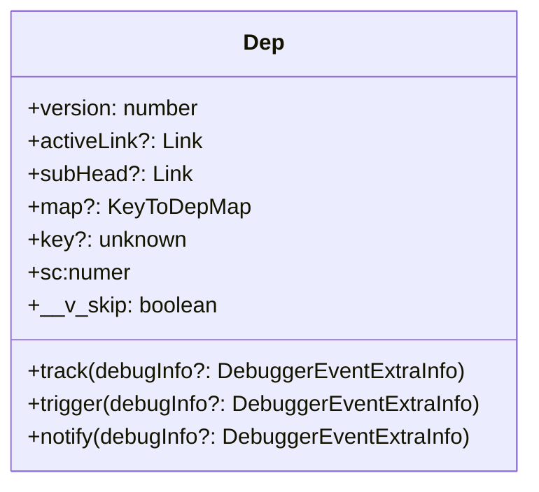

# dep

为什么 Link 中，对于 track 函数，激活的订阅者是计算属性，则不进行 track 呢？

<https://github.com/vuejs/core/blob/e8d8f5f604e821acc46b4200d5b06979c05af1c2/packages/reactivity/src/dep.ts#L109>




```ts

 if (!activeSub || !shouldTrack || activeSub === this.computed) {
      return
    }
```

防止重复 `track`

## Dep 的 trigger 在做什么事情？

- version ++
- globalVersion ++
- notify debugInfo

## 为什么 Track 特定枚举原因

原因：谁依赖了什么数据

`TrackOpTypes`:

- `get`：组件正在读取的数据，建议依赖关系
- `has`：
- `iterate`：

为什么没有 `set/delete`，它们是触发响应式的触发器而不是被追踪的目标
