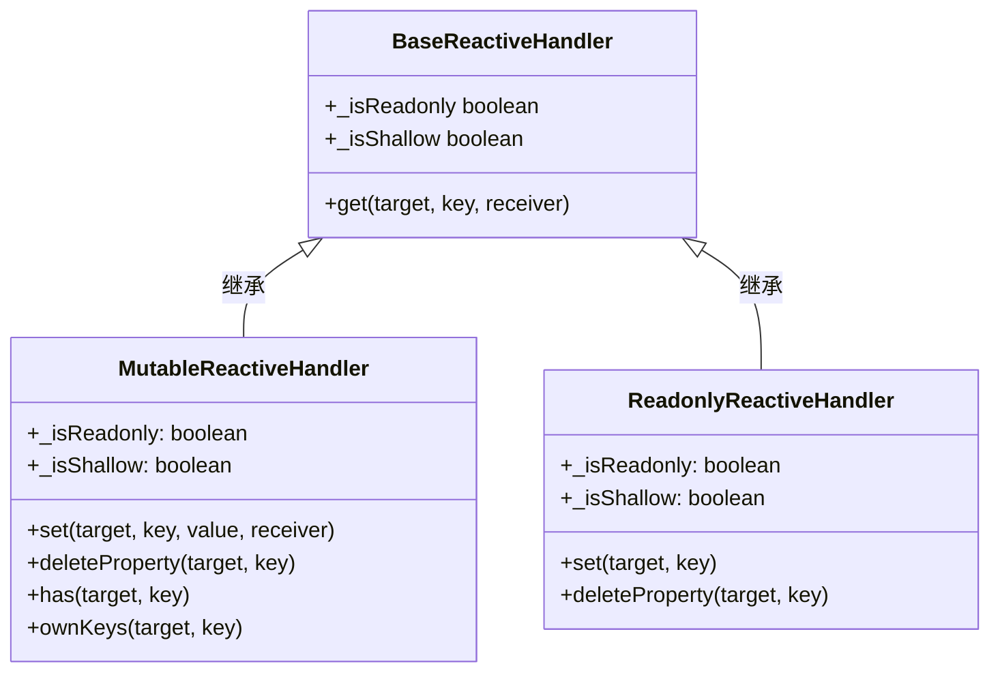
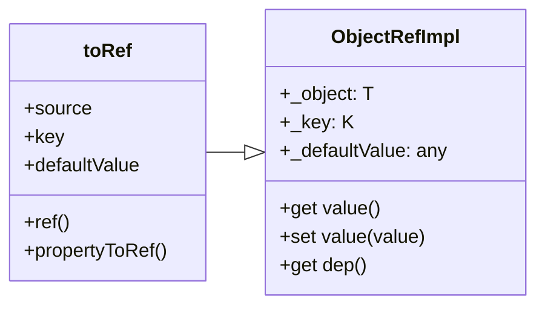

# reactive 概述

## 单元测试 roadmap

| 核心函数       | 说明                   |
|------------|----------------------|
| `ref`      |                      |
| `reactive` |                      |
| `computed` | 调用 `ComputedRefImpl` |

| 核心 class                  | 说明                                                                          |
|---------------------------|-----------------------------------------------------------------------------|
| `EffectScope`             |                                                                             |
| `ObjectRefImpl`           | 内部，propertyToRef 工具调用，根据对象属性选择适合的 ref 类型，`toRef`、`toRefs` 的具体实现             |
| `GetterRefImpl`           | 内部，`toRef`函数入参为函数时调用，无法 set，会报错                                             |
| `ReactiveEffect`          | 被 `watch`、`effect` 调用                                                       |
| `Dep`                     |                                                                             |
| `ComputedRefImpl`         |                                                                             |
| `Link`                    |                                                                             |
| `BaseReactiveHandler`     | 给 reactive 函数， set 使用，`MutableReactiveHandler`、`ReadonlyReactiveHandler` 继承 |
| `MutableReactiveHandler`  | 给 reactive 函数，用于`Map、Set、WeekMap、WeakSet`                                   |
| `ReadonlyReactiveHandler` | 给 reactive 函数，用于`Map、Set、WeekMap、WeakSet`                                   |
| `RefImpl`                 |                                                                             |
| `CustomRefImpl`           |                                                                             |

`BaseReactiveHandler` class：



`toRef()` 函数：



## 核心技术方案

### WeakMap 全局性代理对象集合

用于存储代理对象，并且不关注何时回收，由 GC 自动处理。

只有四个方法：

- `get()`
- `set()`
- `delete()`
- `has()`

### Proxy 代理

⚠️*仅能处理对象*，对于基本属性，则无法代理。

### 对象 set、 get 方法

处理基本属性，利用 `set`、`get` 的内置方法对对象进行拦截出来。

### 重写集合方法

- `Map`、`Set`、`WeakMap`、`WeakSet`（迭代类）

### 双链表管理响应式

## ref 和 reactive 函数区别

`ref`：使用名叫 `RefImpl` class 实现
`reactive`: 使用 `createReactiveObject` 函数实现

| 差异   | reactive                                | ref                  |
|------|-----------------------------------------|----------------------|
| 实现逻辑 | `createReactiveObject`                  | `class RefImpl`      |
| 用途   | 对象                                      | `.value` 访问响应式       |
| 特殊情况 | 访问数组或`Map` 不会解包，使用 `shallowReactive` 替换 | ref 给 reactive 会自动解包 |

## shallowReactive 和 shallowReadonly 区别

```ts
import { shallowReadonly, shallowReactive, isReadonly } from '@vue/reactivity'

const shallowReadonlyData = shallowReadonly({
  foo: 1,
  nested: {
    bar: 2
  }
})

const shallowReactiveData = shallowReactive({
  foo: 1,
  nested: {
    bar: 2
  }
})
shallowReadonlyData.foo++ // error
expect(isReadonly(shallowReadonlyData.nested)).toBe(false)
shallowReadonlyData.nested.bar++
expect(shallowReadonlyData.nested.bar).toBe(3)


shallowReactiveData.foo++ // success
expect(isReadonly(shallowReactiveData.nested)).toBe(false)
expect(shallowReactiveData.nested.bar++).toBe(2)
```
