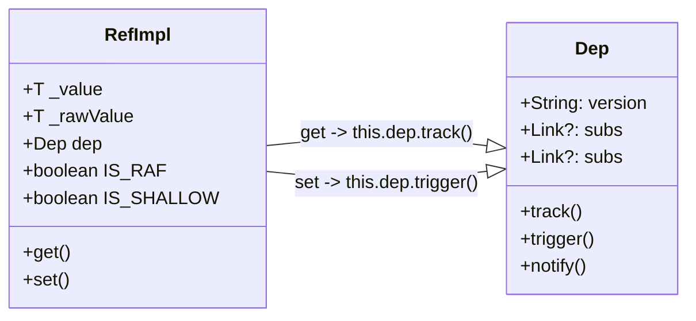

# ref

## 基本规则

- 给基本数据类型使用的

## class RefImpl

- `_value` 存储数据
- `_rawValue` 原始数据
- `deps` 创建依赖树
- `IS_REF` ref 标记，默认 true
- `IS_SHALLOW`，浅层数据，默认 false

get 时候返回 `this._value`，同时 `this.dep.track()` 追踪启动。

set 时，从 `this._rawValue` 作为 `oldValue` 与 `newValue` 对比，不同则进行 `this.dep.trigger()`，否则什么都不做

### this。dep.track() 做了什么？

### this.dep.trigger() 做了什么？

- class Dep 中的 `this.version++`，单个 ref 的 `.value` 被 `set` 的次数。
- `globalVersion++`，全局变量

最后，执行核心 `Dep` 的实例方法 **`this.notify()`**，`notify()` 函数执行一次 `startBatch` 函数，目的就是执行全局变量
`batchDepth++`，以计算深度。

紧接着，遍历 `this.subs`,如果存在 `link.sub.notify()`，则执行 `link.dep.notify()`。

最后执行 `endBatch()` 函数。

